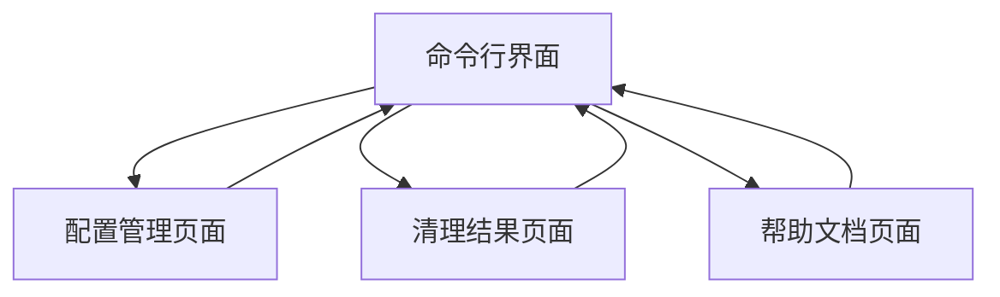

# Code Sweeper 产品需求文档

## 1. 产品概述

Code Sweeper 是一款轻量级的JavaScript/TypeScript代码清理工具，专注于自动化清理项目中的冗余代码和优化代码质量。

- 解决现有工具（ESLint、Prettier）配置复杂、无法一键清理结构性冗余的痛点，为前端开发者提供简单易用的代码清理解决方案。
- 目标成为前端项目维护的必备工具，特别适用于老项目重构、CI/CD流水线集成和代码提交前的自动化清理。

## 2. 核心功能

### 2.1 用户角色

| 角色 | 使用方式 | 核心权限 |
|------|----------|----------|
| 开发者 | 命令行工具安装使用 | 可执行所有代码清理功能，配置清理规则 |

### 2.2 功能模块

我们的代码清理工具包含以下主要页面：

1. **命令行界面**：交互式清理选项、进度显示、清理结果报告
2. **配置管理页面**：规则配置、项目设置、清理选项定制
3. **清理结果页面**：清理统计、文件变更详情、操作日志
4. **帮助文档页面**：使用指南、配置说明、常见问题解答

### 2.3 页面详情

| 页面名称 | 模块名称 | 功能描述 |
|----------|----------|----------|
| 命令行界面 | 交互式清理 | 提供清理选项选择、显示实时进度、展示清理结果摘要 |
| 命令行界面 | AST分析引擎 | 基于AST静态分析清理无用import、删除未使用变量和函数 |
| 命令行界面 | 调试代码清理 | 自动移除console.log、debugger等调试语句 |
| 配置管理页面 | 规则配置 | 支持JSON/YAML格式配置文件、自定义清理规则、项目特定设置 |
| 配置管理页面 | 文件重命名 | 检测并重命名文件和变量（下划线转驼峰等命名规范） |
| 清理结果页面 | 变更统计 | 显示清理前后对比、文件修改数量、代码行数变化 |
| 清理结果页面 | 操作日志 | 记录所有清理操作、支持撤销功能、生成清理报告 |
| 帮助文档页面 | 使用指南 | 提供命令行参数说明、配置文件示例、最佳实践建议 |

## 3. 核心流程

开发者使用Code Sweeper的主要操作流程：

1. 开发者在项目根目录执行清理命令
2. 工具读取配置文件或使用默认规则
3. AST分析引擎扫描项目文件
4. 识别无用代码并生成清理计划
5. 用户确认后执行清理操作
6. 生成清理报告和操作日志

## 4. 用户界面设计

### 4.1 设计风格

- 主色调：深蓝色(#1e3a8a)和绿色(#10b981)，体现专业性和清理完成的成就感
- 按钮样式：圆角矩形按钮，hover效果明显
- 字体：等宽字体用于代码显示，无衬线字体用于界面文本，主要字号14px-16px
- 布局风格：简洁的命令行风格界面，卡片式信息展示
- 图标风格：使用简洁的线性图标，扫帚🧹和代码📝相关的emoji

### 4.2 页面设计概览

| 页面名称 | 模块名称 | UI元素 |
|----------|----------|--------|
| 命令行界面 | 交互式清理 | 深色终端背景，绿色文字提示，进度条使用蓝色渐变，清理选项使用复选框列表 |
| 配置管理页面 | 规则配置 | 白色背景卡片布局，JSON编辑器使用深色主题，配置项使用开关按钮和下拉选择 |
| 清理结果页面 | 变更统计 | 使用图表展示清理数据，绿色表示成功清理，黄色表示警告，红色表示错误 |
| 帮助文档页面 | 使用指南 | 简洁的文档布局，代码示例使用语法高亮，搜索功能突出显示 |

### 4.3 响应式设计

主要面向桌面端开发者使用，命令行工具为主，Web界面为辅助配置工具，支持基本的移动端适配以便开发者在移动设备上查看清理报告。